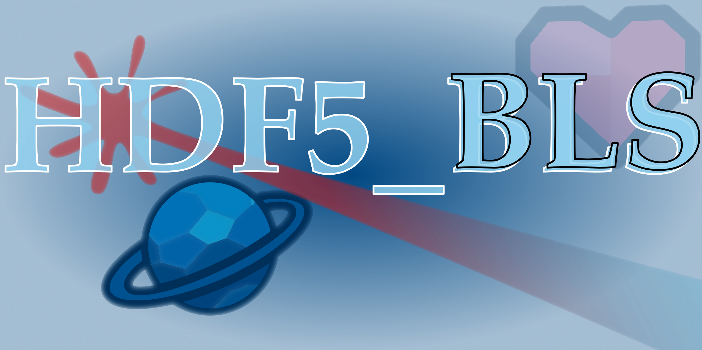

.. HDF5_BLS documentation master file, created by
   sphinx-quickstart on Wed Jan  8 12:55:51 2025.
   You can adapt this file completely to your liking, but it should at least
   contain the root `toctree` directive.

Welcome to the documentation of the HDF5_BLS project!
=====================================================

.. hint:: About HDF5_BLS

   The `HDF5_BLS` project is a Python package allowing users to store Brillouin Light Scattering relevant data in a single HDF5 file. The package is designed to integrate in existing Python workflows, to be minimally constrained, and to be as easy to use as possible. The package is meant to answer three main specifications:

   - **Simplicity**: Make it easy to store and retrieve data from a single file.
   - **Universality**: Allow all modalities to be stored in a single file, while unifying the metadata associated to the data.
   - **Unification**: Allow and develop unified data processing tools to be used on BLS data.

 A project aiming at unifying and standardizing the storage of Brillouin Light Scattering (BLS) data in a HDF5 files, and to develop unified tools to process these data.

This documentation is intended to help users to understand the project and to use it in their own workflows.

GitHub repository: `https://github.com/bio-brillouin/HDF5_BLS <https://github.com/bio-brillouin/HDF5_BLS>`__

For any question, please contact the main developer of the project: `Pierre Bouvet <pierre.bouvet@meduniwien.ac.at>`__

.. raw:: latex

   \part{File format guide}

.. toctree::
   :maxdepth: 4
   :caption: The project

   source/project_nutshell
   source/project
   source/quickstart
   source/file_format
   source/normalization

.. raw:: latex

   \part{User Guide}

.. toctree::
   :maxdepth: 4
   :caption: User Guide

   source/hdf5_bls_package
   source/data_processing
   source/hdf5_bls_analyse_package
   source/hdf5_bls_treat_package

.. raw:: latex

   \part{GUI}

.. toctree::
   :maxdepth: 4
   :caption: GUI

   source/gui_attributes

.. raw:: latex

   \part{Developer Guide}

.. toctree::
   :maxdepth: 4
   :caption: Developer Guide

   source/developer/presentation
   source/developer/setup
   source/developer/add_file_format

.. raw:: latex

   \part{Application Programming Interface}

.. toctree::
   :maxdepth: 4
   :titlesonly:
   :caption: API
   
   source/summary_HDF5_BLS
   source/summary_HDF5_BLS_analyse
   source/summary_HDF5_BLS_treat

