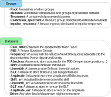

.. HDF5_BLS documentation master file, created by
   sphinx-quickstart on Wed Jan  8 12:55:51 2025.
   You can adapt this file completely to your liking, but it should at least
   contain the root `toctree` directive.

.. figure:: _static/banner.svg

.. admonition:: About HDF5_BLS

   The `HDF5_BLS` project is a Python package allowing users to easily store Brillouin Light Scattering relevant data in a single HDF5 file. The package is designed to integrate in existing Python workflows and to be as easy to use as possible. The package is a solution for unifying the data storage of Brillouin Light Scattering experiments, with three main goals:

   - **Simplicity**: Make it easy to store and retrieve data from a single file.
   - **Universality**: Allow all modalities to be stored in a single file, while unifying the metadata associated to the data.
   - **Expandability**: Allow the format to grow with the needs of the community.

In a nutshell
=============

The strategy followed to achieve the goals presented above, is to reproduce the file structure you would use for your experiment in a unified file format: HDF5. This is a concrete example of file structure corresponding to an experiment (ledt) and the corresponding HDF5 file (right, displayed using `Panoply <https://www.giss.nasa.gov/tools/panoply/>`__), used to store Brillouin Light Scattering data.

.. figure:: _static/File_system_HDF5_file.svg
   :width: 100%
   :align: center

   A concrete example of measures stored in a file system (left) and the corresponding HDF5 file structure (right, using `Panoply <https://www.giss.nasa.gov/tools/panoply/>`__).

Aside from the organization and the data storage, this file format also allows to store metadata associated to the data, say the wavelength of the laser used or the confocal parameters. These metadata are stored with the data they are associated to, allowing for a unified way to store both the data and the metadata.

**Sounds interesting, but how do you allow different modalities (spectra derived from TFP measurements, Time-domain measurements or VIPA spectrometers for example) to be stored in the same file?**

The cool thing about the strategy presented above, is that you can store your data "as is", so from the moment your data is a dataset, you can store it in a HDF5 file. Now this doesn't mean that you'll have as many datasets as there are people in teh community! One step we all pass through for treating our BLS data, is to convert the data to a Power Spectral Density (PSD) and a frequency axis (frequency). By encouraging you to store these two arrays in the same file, we essentially have a unified file format for the community that is essentially limitless.

**I see, but how do I differentiate my "raw data" from my "PSD" and "frequency"? And what about the other datasets (shift, linewidth...)?**

That's a great question! and the answer is that we add to each element of the HDF5 file, a specific "Brillouin\_type" attribute that will flag the nature of the dataset. Same goes for the groups, if a group contains say a calibration spectrum, it has a Brillouin\_type of "Calibration\_spectrum". Here are the exhaustive list of types currently supported:

   A visual representation of the Brillouin\_type attribute for groups and datasets in the HDF5 file.

**😱 Sounds complicated to do 😱**

That's why, to simplify everything, we've made a dedicated Python package: HDF5\_BLS to take care of complicated things!

Go check the quickstart guide to get started! 😉 

Contents:
---------

.. toctree::
   :maxdepth: 3
   
   source/quickstart
   source/file_format
   source/hdf5_bls_package
   

API
===

.. autosummary::
   :toctree: _autosummary
   :recursive:

   HDF5_BLS.wrapper 
   HDF5_BLS.analyze
   HDF5_BLS.treat
   HDF5_BLS.load_data
