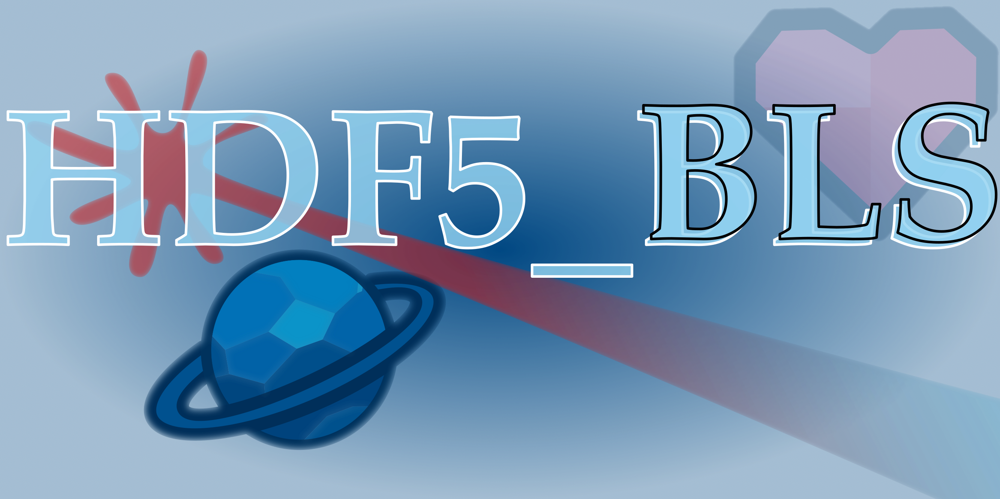

.. HDF5_BLS documentation master file, created by
   sphinx-quickstart on Wed Jan  8 12:55:51 2025.
   You can adapt this file completely to your liking, but it should at least
   contain the root `toctree` directive.

Welcome to the documentation of the HDF5_BLS project!
=====================================================

.. hint:: About HDF5_BLS

   The `HDF5_BLS` project is a norm defined to be used with HDF5 files (and other hierarchical file formats) to store Brillouin Light Scattering relevant data. 
   
   The project comes with three Python packages, `HDF5_BLS`, `HDF5_BLS_treat`, and `HDF5_BLS_analyse`, which are designed to integrate in existing Python workflows, to be minimally constrained, and to be as easy to use as possible. 
   
   The project is meant to answer three main specifications:

   - **Simplicity**: Make it easy to store and retrieve data from a hierarchical file.
   - **Universality**: Allow all modalities to be stored in a single file, while unifying the metadata associated to the data.
   - **Unification**: Allow and develop unified data processing tools to be used on BLS data.

This documentation is intended to help users to understand the project and to use it in their own workflows.

GitHub repository: `https://github.com/bio-brillouin/HDF5_BLS <https://github.com/bio-brillouin/HDF5_BLS>`__

For any question, please contact the main developer of the project: `Pierre Bouvet <pierre.bouvet@meduniwien.ac.at>`__

A quick example 
---------------

The HDF5_BLS norm is a non-constraining organization of an HDF5 file to unify the storage of Brillouin Light Scattering data. Here is a typical example of the layout of a HDF5 file following the norm:

.. treeview::

   - :dir:`file` file.h5
     - :dir:`folder` Brillouin 
     - :icon:`icon_attr` HDF5_BLS_version: 1.1.0
       - :dir:`folder` Sample 1
         - :icon:`icon_attr` MEASURE.Sample: NHCF-V + 0mM NaCl
         - :icon:`icon_attr` SPECTROMETER.Type: 2-VIPA
         - :dir:`folder` Measure 1
           - :icon:`icon_attr` MEASURE.Temperature_(C): 37
           - :dir:`file` PSD
           - :dir:`file` Frequency
             - :dir:`folder` Treatment
             - :icon:`icon_attr` Treatment: import numpy as np ...
               - :dir:`file` Shift
               - :dir:`file` Linewidth
         - :dir:`folder` Measure 2
         - :icon:`icon_attr` MEASURE.Temperature_(C): 35
           - :dir:`file` ...
       - :dir:`folder` Sample 2
         - :icon:`icon_attr` MEASURE.Sample: NHCF-V + 150mM NaCl
         - :dir:`folder` ...
     - :dir:`folder` Other data not following the HDF5_BLS norm

This file would for example store a study on Fibroblasts under different temperature and concentration of NaCl using the HDF5_BLS norm. 

.. note:: What HDF5_BLS brings to the table

   - You keep your HDF5 files.
   - You can store your codes with the data you are processing.
   - You get a unified way to name attributes
   - You can process the data using a unified pipeline.
   - A human-readable file structure with no constraints on the content of the file (you can even add complementary non-BLS data in the same file)
   - The existing HDF5 ecosystem remains available (h5py, hdfview, ...)

.. important:: What HDF5_BLS is not

   - It is not a data format: it doesn't define how the data is stored, only how it is organized
   - It is not a constraint: it only suggests a minimally constraining structure to improve data sharing, availability and traceability.

.. tip:: What HDF5_BLS builds towards
   
   - Unification of storage of BLS data in HDF5 files
   - Unification of BLS data processing
   - Make BLS data more FAIR
   - Reduce variability and irreproducibility of BLS data analysis
   - Make BLS data more accessible and easier to share
   - Streamline multi-modal and multi-user meta-analyses of BLS data
   

.. raw:: latex

   \part{File format guide}

.. toctree::
   :maxdepth: 4
   :caption: The project

   source/project/project_nutshell
   source/project/project
   source/project/quickstart
   source/project/file_format
   source/project/normalization
.. Last full check: 2026-05-24

.. raw:: latex

   \part{User Guide}

.. toctree::
   :maxdepth: 4
   :caption: User Guide

   source/user_guide/hdf5_bls_package
   source/user_guide/data_processing
   source/user_guide/hdf5_bls_analyse_package
   source/user_guide/hdf5_bls_treat_package

.. raw:: latex

   \part{GUI}

.. toctree::
   :maxdepth: 4
   :caption: GUI

   source/hdf5_bls_gui/gui_quickstart
   source/hdf5_bls_gui/gui_attributes

.. raw:: latex

   \part{Developer Guide}

.. toctree::
   :maxdepth: 4
   :caption: Developer Guide

   source/developer/presentation
   source/developer/setup
   source/developer/add_file_format

.. raw:: latex

   \part{Application Programming Interface}

.. toctree::
   :maxdepth: 4
   :titlesonly:
   :caption: API
   
   source/summary_HDF5_BLS
   source/summary_HDF5_BLS_analyse
   source/summary_HDF5_BLS_treat

