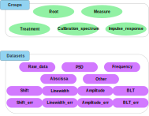

.. HDF5_BLS documentation master file, created by
   sphinx-quickstart on Wed Jan  8 12:55:51 2025.
   You can adapt this file completely to your liking, but it should at least
   contain the root `toctree` directive.

.. figure:: _static/banner.svg

.. admonition:: About HDF5_BLS

   The `HDF5_BLS` project is a Python package allowing users to easily store Brillouin Light Scattering relevant data in a single HDF5 file. The package is designed to integrate in existing Python workflows and to be as easy to use as possible. The package is a solution for unifying the data storage of Brillouin Light Scattering experiments, with three main goals:

   - **Simplicity**: Make it easy to store and retrieve data from a single file.
   - **Universality**: Allow all modalities to be stored in a single file, while unifying the metadata associated to the data.
   - **Expandability**: Allow the format to grow with the needs of the community.

In a nutshell
=============

The idea is to reproduce the file structure you would use for your experiment, in a HDF5 file. We then add attributes to unify the way we store and use BLS data.

.. figure:: _static/File_system_HDF5_file.svg
   :width: 75%
   :align: center

   A concrete example of measures stored in a file system (background) and the corresponding HDF5 file structure (foreground, using `Panoply <https://www.giss.nasa.gov/tools/panoply/>`__).

HDF5 files are composed of groups  and datasets. A group is a container that can contain other groups or datasets. A dataset is a container that stores data.

**But what about the different modalities?** 

You can store your data "as is" (what the spectrometer returns), but we recommend storing the associated Power spectral density (PSD) and frequency axis (frequency) in the HDF5 file. This will allow everyone to have access to a unified "nature" of the data. 

**But how do I differentiate between the different types of datasets?**

We add to each element of the HDF5 file, a "Brillouin\_type" attribute that will allow to know the type of the element. Here are the following types:

   A visual representation of the Brillouin\_type attribute for groups and datasets in the HDF5 file.

**😱 Sounds complicated 😱**

That's why, to simplify everything, we've made a dedicated Python package: HDF5\_BLS to take care of complicated things!

Go check the quickstart guide to get started! 😉 

Contents:
---------

.. toctree::
   :maxdepth: 3
   
   source/quickstart
   source/file_format
   source/hdf5_bls_package
   

API
===

.. autosummary::
   :toctree: _autosummary
   :recursive:

   HDF5_BLS.wrapper 
   HDF5_BLS.analyze
   HDF5_BLS.treat
   HDF5_BLS.load_data
