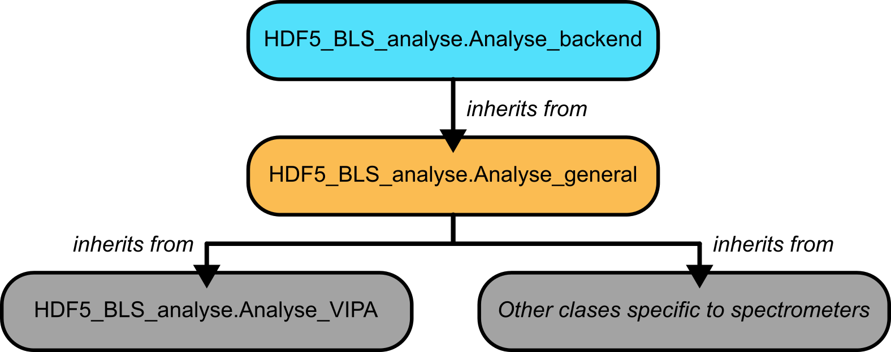
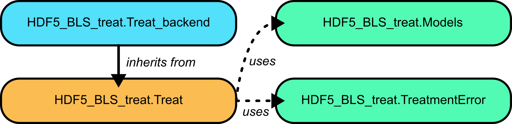

Data Processing with HDF5_BLS
=============================

Specifications
--------------

Data processing is arguably the second most important part of any study, following the acquisition of the data. Currently, no consensus exists on the way data are processed in BLS. Here, we propose a solution to that problem by offering two packages for unifying the extraction of a Power Spectral Density (PSD) from measures and extracting information from the PSD. 

These two packages, namely *HDF5_BLS_analyse* and *HDF5_BLS_treat* are based on the same idea: encouraging the use of unified algorithms while allowing other algorithms to be developped and used. To that end, we built these packages with the following specifications in mind:

- **Modularity**: Algorithms are defined as a succession of "standard functions" that serve as basic blocks. Any algorithm utilizing these basic blocks can therefore be applied. 
- **Reversible processing**: Algorithms can be stored in objects and re-run entirely or partially (up to a certain function) 
- **Algorithm storage**: Algorithms can be stored as standalone files which can be imported, exported and edited. 
- **Algorithm readability**: Algorithms are saved with a description of what they do and how they do it. The docstring of the functions used can also be compiled together to obtain a human readable description of the process followed during the algorithm 
- **Developper friendliness**: Addition of functions to the processing module should be accessible to most. 

With these 5 points in mind, we can describe the process followed in the development of the two processing modules.

Organization of the modules
---------------------------

The modules are organized in classes, that are either used as "accesories" (for storing analytical definition of models for example) or as "main actors" (classes where the processing functions are defined). These latter classes inherit from "backend" classes which are silent objects used as observers of the execution of the code, and tools for the manipulation of algorithms. The backend classes are:

- **Treat_backend**: The backend class of the *HDF5_BLS_treat* module 
- **Analyse_backend**: The backend class of the *HDF5_BLS_analyse* module

.. admonition:: Important

    These classes are low-level classes developped as the basis for the rest of the modules to be built on. They should be silent and not be used directly by the user.

HDF5_BLS_analyse
^^^^^^^^^^^^^^^^
.. include:: hdf5_bls_analyse_package/organisation.rst

   A visual representation of the structure of the *HDF5_BLS_analyse* module.

HDF5_BLS_treat
^^^^^^^^^^^^^^

.. include:: hdf5_bls_treat_package/organisation.rst

   A visual representation of the structure of the *HDF5_BLS_treat* module.

Usage points common to both modules
-----------------------------------

The modules share some methods, in particular:

- For opening, saving and editing algorithms 
- For running algorithms
- For adding points of interest

These methods are silent in the sense that they cannot be stored in an algorithm file. Please refer to the API of the modules (see :ref:`API-Analyse` and :ref:`API-Treat`) for more information.

Using the HDF5_BLS_analyse module
---------------------------------

.. include:: hdf5_bls_analyse_package/usage.rst

Using the HDF5_BLS_treat module
---------------------------------

.. include:: hdf5_bls_treat_package/usage.rst

