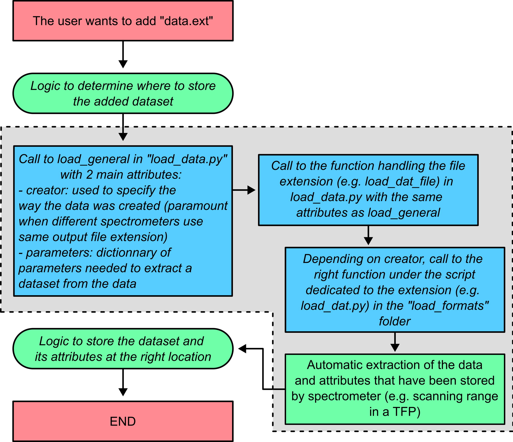

Adding a new file format to the HDF5_BLS library
=================================================

One of the first challenges for unifying the community is to allow everyone to use the same file format to store their data. To this end, we have isolated the script responsible for the loading of data from the main source code of the HDF5_BLS library. 

The script responsible for the loading of data is located at ".../HDF5_BLS/src/load_data.py". This script is then calls other sub-scripts depending on the extension of the data to be loaded. These sub-scripts are located in the ".../HDF5_BLS/src/load_data" folder.

Let's visually represent the logic behind the loading of data in :numref:`logic_adding_data`.

.. _logic_adding_data:

    The logic behind the loading of data.

:numref:`logic_adding_data` shows in the grey area the steps that will have to be adjusted to the new file format the user wants to use. Let's go through the process step by step. Practically, these are the scripts we'll need to modify:
- .../src/load_data.py: the main script that calls the sub-scripts depending on the extension of the data to be loaded
   - function specific to the extension of the file format (e.g. *load_dat_file* for DAT files or *load_npy_file* for numpy files)
   - *load_general* function that calls the specific function depending on the extension of the file format 
- .../src/load_formats/....py: the sub-script that loads data from a file of the specific extension

Let's go through the steps to add support for a new file format one by one.