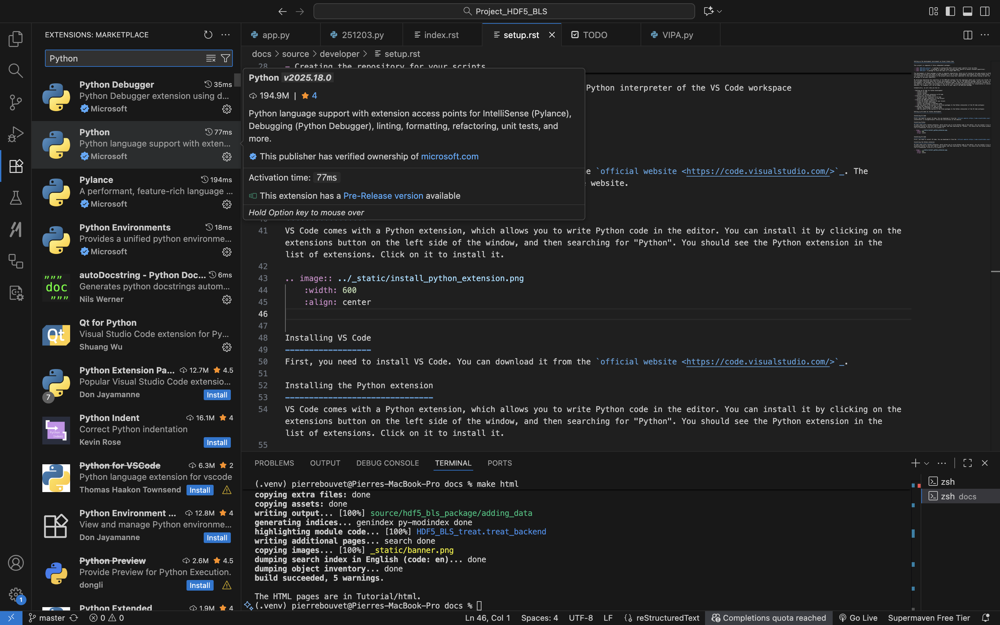

.. _developer_setup_vscode:

Setting up the development environment on Visual Studio Code
=============================================================

This project is composed of three independent packages (plus the GUI and the web viewer, but we will not detail them here):

- :code:`HDF5_BLS_analyse`: A package to analyse BLS data (extract power spectra) from raw data.
- :code:`HDF5_BLS_treat`: A package to treat BLS data (process power spectra to obtain relevant quantities).
- :code:`HDF5_BLS`: A package to store BLS data in a single HDF5 file.

The development of these packages is done in separate repositories, which are all hosted on the same project on GitHub. The following instructions are meant to help developers to set up their development environment on Visual Studio Code, so that they can contribute to the development of the project while using their additions to the code without having to wait for the code to be merged in the main repository.

We encourage separating the repository of the HDF5_BLS package from the repository where your scripts are stored. Therefore, we will present a solution where two virtual environments are used: one for the HDF5_BLS package, and one for your scripts. In both environments, the packages will be installed in editable mode, so that your modifications are directly reflected in the code, but any addition on the virtual environment of the scripts used (installing custom packages for visualization or statistical analysis, for example) will not be added to the VE of your copy of the HDF5_BLS package.

Schematically, we will show you how to:

- Setting up VS Code for Python development
   - Install VS Code 
   - Install the Python extension in VS Code
- Creating your own GitHub branch and copy of the HDF5_BLS repository
   - Install the Git extension in VS Code
   - Clone the GitHub repository
   - Branch the main repository of the project
   - Create a virtual environment
   - Install the packages in editable mode
   - Add the paths to the sources of the three packages to the Python interpreter of the VS Code workspace
- Creating the repository for your scripts
   - Install the packages in editable mode
   - Add the paths to the sources of the three packages to the Python interpreter of the VS Code workspace

Setting up VS Code for Python development
------------------------------------------

Installing VS Code
~~~~~~~~~~~~~~~~~~
First, you need to install VS Code. You can download it from the `official website <https://code.visualstudio.com/>`_. The installation is straightforward: follow the instructions on the website.

Installing Python extension in VS Code
~~~~~~~~~~~~~~~~~~~~~~~~~~~~~~~~~~~~~~
VS Code comes with a Python extension, which allows you to write Python code in the editor. You can install it by clicking on the extensions button on the left side of the window, and then searching for "Python". You should see the Python extension in the list of extensions. Click on it to install it.

Creating your own GitHub branch and copy of the HDF5_BLS repository
-------------------------------------------------------------------

Installing the Git extension in VS Code
~~~~~~~~~~~~~~~~~~~~~~~~~~~~~~~~~~~~~~~
The first step is to install the Git extension in VS Code. You can do this by clicking on the extensions button on the left side of the window, and then searching for "Git". We recommend using the "GitHub Actions" extension, which is a Git extension that allows you to use GitHub Actions in VS Code. You can install it by clicking on the extensions button on the left side of the window, and then searching for "GitHub Actions". You should see the GitHub Actions extension in the list of extensions. Click on it to install it.

Creating the HDF5_BLS repository locally
~~~~~~~~~~~~~~~~~~~~~~~~~~~~~~~~~~~~~~~~
Now that everything is set up, you can create a local repository for the HDF5_BLS package where you will store your additions to the code. You can just click on File > Open Folder and then create and select the folder where you want to create the repository. 

Creating the virtual environment
~~~~~~~~~~~~~~~~~~~~~~~~~~~~~~~~
A very important step at this stage is to create a virtual environment for the HDF5_BLS package. This makes sure that the packages are installed in a way that does not interfere with the local installation of Python on your computer.

VS Code comes with a Python extension, which automatically creates a virtual environment for you. Use this tool by opening the command palette (Ctrl+Shift+P) and typing "Python: Create Environment...". We recommend using Python 3.9 or above. You should see a new folder called ".venv" in your workspace. This is the virtual environment that you will use for the HDF5_BLS package.

Clone the GitHub repository
~~~~~~~~~~~~~~~~~~~~~~~~~~~
You can now safely clone the GitHub repository of the project. You can do this by clicking on the "Source Control" button on the left side of the window, then click on the three dots right to the "Changes" text, and then clicking on "Clone". You can then copy and paste the URL of the repository: `https://github.com/bio-brillouin/HDF5_BLS <https://github.com/bio-brillouin/HDF5_BLS>`__ in the text field that appears. This will clone the repository in the folder you have created in the previous step. After the cloning is done, you will see all the folders and files of the repository in your VS Code workspace.

Branching the main repository of the project
~~~~~~~~~~~~~~~~~~~~~~~~~~~~~~~~~~~~~~~~~~~~
Although you can decide to keep your addition to the HDF5_BLS package to yourself, if you want to contribute to the development of the project, you will need to create a branch of the main repository of the project. This will allow you to work on your own additions to the code, and then send merge requests when your additions are ready to be integrated in the main repository.

To branch the main repository of the project, you can click on the "Source Control" button on the left side of the window, and then on the "Branch > Create Branch". You can then name the branch whatever you want.

Install the packages in editable mode
~~~~~~~~~~~~~~~~~~~~~~~~~~~~~~~~~~~~~
The different packages of the HDF5_BLS project are not yet installed in your virtual environment at this step. We encourage you to install them in editable mode. This will allow you to make changes to the code and see the results immediately by simply importing the libraries in Python scripts.

To install it the different packages you need to move to the different directories, and then install the packages using the following command in the terminal:

.. code-block:: bash

    pip install -e .

Adding the paths to the sources of the three packages to the Python interpreter of the VS Code workspace
~~~~~~~~~~~~~~~~~~~~~~~~~~~~~~~~~~~~~~~~~~~~~~~~~~~~~~~~~~~~~~~~~~~~~~~~~~~~~~~~~~~~~~~~~~~~~~~~~~~~~~~~

Once the packages are installed in editable mode, you will need to "tell" your code editor where the sources of the packages are located (since the modules are installed in edit mode). There are different ways to do this, the one we recommend is to create "aliases" of the source directories of the packages and place them in the site-packages directory of your virtual environment. This way, when you import a module from the package, your editor will automatically find the source code of the package and give you all the nice autocompletion features to use it.

You can create the aliases either by:
- finding the virtual environment directory (the one where the ``.venv`` directory is located) and then the 
- locating thelib/python.x/site-packages directory of the virtual environment (the "x" in python.x is the version of python you are using)
- creating the aliases of the sources in your file system (here we will use the "_HDF5_BLS" directory of the HDF5_BLS package, the "_HDF5_BLS_analyse" directory of the HDF5_BLS_analyse package and the "_HDF5_BLS_treat" directory of the HDF5_BLS_treat package)
- moving the aliases to the site-packages directory of the virtual environment
- renaming the aliases to the name of the package (here "HDF5_BLS", "HDF5_BLS_analyse" and "HDF5_BLS_treat")

Alternatively, you can create the aliases by using the command line:
- first navigate to the virtual environment directory (the one where the ``.venv`` directory is located)
- then navigate to the lib/python.x/site-packages directory of the virtual environment (the "x" in python.x is the version of python you are using)
- then copy the path to the _HDF5_BLS directory of the HDF5_BLS package (the path should look something like this: ``.../Project_HDF5_BLS_release/packages/HDF5_BLS/src/_HDF5_BLS``)
- then create a symbolic link to the HDF5_BLS package source directory by running the following command in the terminal: ``ln -s /path/to/HDF5_BLS/src/_HDF5_BLS HDF5_BLS``
- repeat the same steps for the other two packages.

Restart your code editor and you should be good to go. You can for example try to import the HDF5_BLS package in your code editor, and autocompletion should work as expected.

Creating the repository for your scripts
----------------------------------------

Now that you have a working copy of the HDF5_BLS repository you can edit locally, we recommend using a separate repository for the scripts that will use it to keep everything clean.

Create your local repository for using the HDF5_BLS package
~~~~~~~~~~~~~~~~~~~~~~~~~~~~~~~~~~~~~~~~~~~~~~~~~~~~~~~~~~~

Start by creating a repository that will contain your scripts in your file system.

Create the virtual environment of your repository
~~~~~~~~~~~~~~~~~~~~~~~~~~~~~~~~~~~~~~~~~~~~~~~~~

Now you need to create a virtual environment for your repository. Aside from being good practice, this will allow you to install the modules of the HDF5_BLS package in editable mode, so that you can make changes to the code and see the results immediately. To do so, you can use the following command in the terminal:

.. code-block:: bash

    python -m venv .venv

This will create a virtual environment in the ``.venv`` directory of your repository. You can then activate it by running the following command in the terminal:

.. code-block:: bash

    source .venv/bin/activate

Install the packages in editable mode
~~~~~~~~~~~~~~~~~~~~~~~~~~~~~~~~~~~~~

You can now install the packages in editable mode. To do so, open your terminal and move to the folder containing the local version of the HDF5_BLS repository. Then, install all three packages in editable mode by running the following command in the terminal:

.. code-block:: bash

    pip install -e packages/HDF5_BLS
    pip install -e packages/HDF5_BLS_analyse
    pip install -e packages/HDF5_BLS_treat

Adding the paths to the sources of the three packages to the Python interpreter of the VS Code workspace
~~~~~~~~~~~~~~~~~~~~~~~~~~~~~~~~~~~~~~~~~~~~~~~~~~~~~~~~~~~~~~~~~~~~~~~~~~~~~~~~~~~~~~~~~~~~~~~~~~~~~~~~

Once the packages are installed in editable mode, you will need to "tell" your code editor where the sources of the packages are located (since the modules are installed in edit mode). There are different ways to do this, but as before, the one we recommend is to create "aliases" of the source directories of the packages and place them in the site-packages directory of your virtual environment. This way, when you import a module from the package, your editor will automatically find the source code of the package and give you all the nice autocompletion features to use it.

You can create the aliases either by:
- finding the virtual environment directory (the one where the ``.venv`` directory is located) and then the 
- locating thelib/python.x/site-packages directory of the virtual environment (the "x" in python.x is the version of python you are using)
- creating the aliases of the sources in your file system (here we will use the "_HDF5_BLS" directory of the HDF5_BLS package, the "_HDF5_BLS_analyse" directory of the HDF5_BLS_analyse package and the "_HDF5_BLS_treat" directory of the HDF5_BLS_treat package)
- moving the aliases to the site-packages directory of the virtual environment
- renaming the aliases to the name of the package (here "HDF5_BLS", "HDF5_BLS_analyse" and "HDF5_BLS_treat")

Alternatively, you can create the aliases by using the command line:
- first navigate to the virtual environment directory (the one where the ``.venv`` directory is located)
- then navigate to the lib/python.x/site-packages directory of the virtual environment (the "x" in python.x is the version of python you are using)
- then copy the path to the _HDF5_BLS directory of the HDF5_BLS package (the path should look something like this: ``.../Project_HDF5_BLS_release/packages/HDF5_BLS/src/_HDF5_BLS``)
- then create a symbolic link to the HDF5_BLS package source directory by running the following command in the terminal: ``ln -s /path/to/HDF5_BLS/src/_HDF5_BLS HDF5_BLS``
- repeat the same steps for the other two packages.

Finally, restart your code editor and you should be good to go. You can for example try to import the HDF5_BLS package in your code editor, and autocompletion should work as expected.