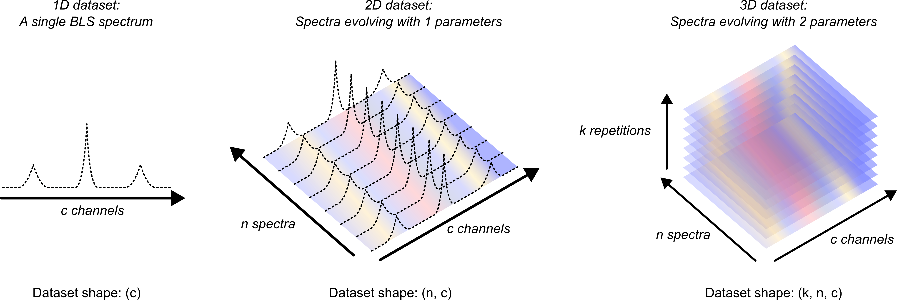
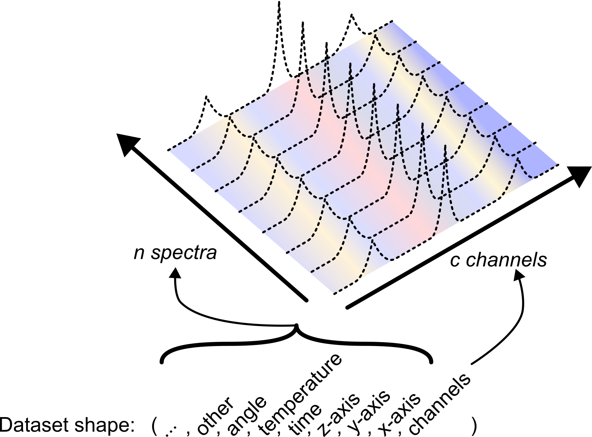

.. _normalization:

Normalization rules for the BioBrillouin community
==================================================

In order to be able to share and compare data between members of the BioBrillouin community, we need to agree on a set of normalization rules. We here propose a basis, largely inspired by the OME community. 

This section is divided in three parts: 

- Normalization rules for attributes
- Normalization rules for datasets
- Normalization rules for organizing HDF5 files

Normalization rules for attributes
----------------------------------

The Brillouin\_type Attributes
^^^^^^^^^^^^^^^^^^^^^^^^^^^^^^

The Brillouin\_type attribute is used to recognize the type of the element. Note that this attribute is therefore the first step in normalizing the file format. It can be any one of the following values:

.. figure:: ../_static/Groups_and_datasets_type.png
   :width: 70%
   :align: center

   A visual representation of the Brillouin\_type attribute for groups and datasets in the HDF5 file.

Hierarchical strorage of attributes
^^^^^^^^^^^^^^^^^^^^^^^^^^^^^^^^^^^

HDF5 file format allows the storage of attributes in the metadata of the groups and datasets. As all the attributes applying to a measure will apply to all the elements of the "measure" group, we propose to store all the attributes concerning an experiment in the attributes of the group:

.. code-block:: bash

    file.h5
    └── Brillouin (group)
        ├── Measure (group) -> attributes of the measure
            └── Measure (dataset)

Being a hierarchical format, we also propose to store attributes hierarchically: all attributes of parent group apply to childre groups (if not redefined in children groups). Storing attributes in large files can therefore be done the following way:

.. code-block:: bash

    file.h5
    └── Brillouin (group) -> attributes shared by Measure 0 and Measure 1
        ├── Measure 0 (group) -> other attributes specific to Measure 0
        │   └── Measure (dataset)
        └── Measure 1 (group) -> other attributes specific to Measure 1
            └── Measure (dataset)

This approach allows us to store for example the parameters of the spectrometer used in a series of measures in the topmost group of the file.

Note that the same logic applies to the treatment of the data. The attributes of the treatment will be stored in the attributes of the "Treatment" group.

.. code-block:: bash

    file.h5
    └── Brillouin (group)
        └── Measure (group) -> attributes of the measure
            ├── Measure (dataset)
            └── Treatment (group) -> attributes of the treatment
                └── Shift (dataset)

Attribute type
^^^^^^^^^^^^^^

In an effort to avoid any incompatibility, we propose to store the values of the attributes as ascii-encoded text. The library will then convert the strings to the appropriate type (e.g. a float for a temperature value).

Organization of the attributes
^^^^^^^^^^^^^^^^^^^^^^^^^^^^^^

Prefix
""""""

We differentiate 5 types of attributes, that we differentiate using the following prefixes:

* SPECTROMETER - Attributes that are specific to the spectrometer used, such as the wavelength of the laser, the type of laser, the type of detector, etc. These attributes are recognized by the capital letter word "SPECTROMETER" in the name of the attribute.
* MEASURE - Attributes that are specific to the sample, such as the date of the measure, the name of the sample, etc. These attributes are recognized by the capital letter word "MEASURE" in the name of the attribute.
* FILEPROP - Attributes that are specific to the original file format, such as the name of the file, the date of the file, the version of the file, the precision used on the storage of the data, etc. These attributes are recognized by the capital letter word "FILEPROP" in the name of the attribute.
* PROCESS - Attributes that are specific to the storage of algorithms. These attributes are recognized by the capital letter word "PROCESS" in the name of the attribute.
* Attributes that are used inside the HDF5 file, such as the "Brillouin\_type" attribute. These attributes are the only ones without a prefix.

Units
"""""

The name of the attributes contains the unit of the attribute if it has units, in the shape of an underscore followed by the unit in parenthesis. Some parameters will also be given following a given norm, such as the ISO8601 for dates. These norms are not specified in the name of the attribute. Here are some examples of attributes:

* "SPECTROMETER.Detector\_Type" is the type of the detector used.
* "MEASURE.Sample" is the name of the sample.
* "MEASURE.Exposure\_(s)" is the exposure of the sample given in seconds
* "MEASURE.Date\_of\_measurement" is the date of the measurement, stored following the ISO8601 norm.
* "FILEPROP.Name" is the name of the file.

To ease the unification of nomenclature and norms of attributes, we propose to use a spreadsheet that contains the list of attributes, their definition, their unit and an example of value. This spreadsheet is available on the project repository and is updated as new attributes are added to the project. Each attribute has a version number that is also stored in the attributes of each data attribute (under FILEPROP.version).

   A visualization of the spreadsheet containing the list of attributes.

Storing analysis and treatment processes performed with the HDF5\_BLS package
^^^^^^^^^^^^^^^^^^^^^^^^^^^^^^^^^^^^^^^^^^^^^^^^^^^^^^^^^^^^^^^^^^^^^^^^^^^^^^

Analysis and treatment processes are stored in the "PROCESS" attribute of the treatment groups. This attribute is a JSON file converted to a string, which contains the list of treatment steps performed on the data. This JSON file has the following structure:

.. code-block:: bash

    {
        "name": "The name of the algorithm",
        "version": "v 0.1",
        "author": "Author name and affiliation",
        "description": "The description of the algorithm",
        "functions": [
        {
            "function": "The 1st function name in the class",
            "parameters": {
                "parameter_1": value,
                "parameter_2": value,
                ...
            },
            "description": "The description of the function"
        },
        {
            "function": "The 2nd function name in the class",
            "parameters": {
                "parameter_1": value,
                "parameter_2": value,
                ...
            },
            "description": "The description of the function"
        },
        ...
        ]
    }

When the treatment is performed using the modules of the HDF5\_BLS package, this attribute is automatically updated. Note that custom treatments can also be stored in this attribute by the user.

This attribute can be exported to a standalone JSON file using the library. This attribute also allows the library to re-apply the treatment to the data, and modify steps of the treatment if needed.  

Storing custom data processing code and visualization code
^^^^^^^^^^^^^^^^^^^^^^^^^^^^^^^^^^^^^^^^^^^^^^^^^^^^^^^^^^

To ease the use of the file format, we propose the user to store their own codes directly as attributes of the groups they apply to. For example, if a code performing a statistical analysis has been used on the data, the user can store this code as a text attribute to the topmost group of the file. This is an unconventional way to store the code, but is has the great advantage of allowing the user to recover the code easily and to re-run it or modify it if needed in the future.

Note that a function of the HDF5\_BLS.Wrapper class (Wrapper.store_script) is available to perform the saving of the script easily. When called in a script, this function retrieves the caller's filename, converts the python script to a text string, and stores it in the HDF5 file (as is).

Normalization rules for datasets
--------------------------------

General guidelines
^^^^^^^^^^^^^^^^^^

1. Datasets should be presented as tensors where the dimensions are attribuated to the different hyperparameters of the experiment (see :numref:`Dataset_multidimensional`).

.. _Dataset_multidimensional:

   A visual representation of different multidimensional datasets storing BLS spectra

2. The dimensions of the tensor should be ordered following this general convention, from last to first dimension (see :numref:`Dataset_dimension_norm`):
   
    - Channels (n)
    - x-axis (n-1)
    - y-axis (n-2) 
    - z-axis (n-3)
    - Time (n-4) 
    - Temperature (n-5)
    - Angle (n-6)
    - Other (n-...)

.. _Dataset_dimension_norm:

   A visual representation of the normalization of the physical meaning of the dimensions of a dataset

3. In cases of non-uniform sampling of one or more of the hyperparameters used in the experiment, the associated dimensions are broadcasted on the highest dimension, and the non-uniform dimension is set to 1:
   
   - Example 1: the temperature (kT values) is non-uniformly sampled on a 2D mapping (of shape (kx, ky)) obtain with a line-scan, there are c channels per PSD supposed uniformly distributed in frequency along the measures: 
  
      -  PSD array shape: (1, 1, 1, ky * kT, kx, c).
      -  Temperature abscissa array shape: (1, 1, 1, ky * kT, 1, 1, 1).
      -  y array shape: (ky, 1, 1).
      -  x array shape: (kx, 1).
  
   - Example 2: the temperature (kT values) is non-uniformly sampled on a 2D mapping (of shape (kx, ky)) obtain with a point-scan, there are c channels per PSD supposed uniformly distributed in frequency along the measures:

      -  PSD array shape: (1, 1, 1, 1, ky * kT * kx, c).
      -  Temperature abscissa array shape: (1, 1, 1, ky * kT * kx, 1, 1, 1).
      -  y array shape: (ky, 1, 1).
      -  x array shape: (kx, 1).

.. note::
    The arrangement of the hyperparameters differs from the one proposed by the OME community as most spectrometers will return the variation of the data with the frequency axis as the last dimension. Note however that for images, a simple transposition of the axes is enough to get a dataset compliant with the OME community convention.

Hierarchical storage of abscissa datasets
^^^^^^^^^^^^^^^^^^^^^^^^^^^^^^^^^^^^^^^^^

If a series of measures are performed using the same abscissa (e.g. a series of 2D mappings on a region of same size between different samples), we can store the abscissa array in the parent group of all the measures sharing this same abscissa. This is optional but allows to equivalent file organizations:

.. code-block:: bash

    file.h5
    └── Brillouin (group, Brillouin_type = "Root")
        ├── Mapping 1 (group, Brillouin_type = "Measure")
        |   ├── x (dataset, Brillouin_type = "Abscissa_1")
        |   ├── y (dataset, Brillouin_type = "Abscissa_2")
        |   ├── PSD (dataset, Brillouin_type = "PSD")
        |   └── Frequency (dataset, Brillouin_type = "Frequency")
        └── Mapping 2 (group, Brillouin_type = "Measure")
            ├── x (dataset, Brillouin_type = "Abscissa_1")
            ├── y (dataset, Brillouin_type = "Abscissa_2")
            ├── PSD (dataset, Brillouin_type = "PSD")
            └── Frequency (dataset, Brillouin_type = "Frequency")

and

.. code-block:: bash

    file.h5
    └── Brillouin (group, Brillouin_type = "Root")
        ├── x (dataset, Brillouin_type = "Abscissa_1")
        ├── y (dataset, Brillouin_type = "Abscissa_2")
        ├── Mapping 1 (group, Brillouin_type = "Measure")
        |   ├── PSD (dataset, Brillouin_type = "PSD")
        |   └── Frequency (dataset, Brillouin_type = "Frequency")
        └── Mapping 2 (group, Brillouin_type = "Measure")
            ├── PSD (dataset, Brillouin_type = "PSD")
            └── Frequency (dataset, Brillouin_type = "Frequency")

For now we do not encourage one solution over the other in the normalization rules.

Clarification on dataset shapes
^^^^^^^^^^^^^^^^^^^^^^^^^^^^^^^

A dataset containing *k* values varying for a single parameter, should have all their lower dimensions set to 1. 

For example:

- a list of values of x-axis coordinates for each step should be of shape (k, 1), where *k* is the number of x coordinates.
- a list of values of y-axis coordinates for each step should be of shape (k, 1, 1), where *k* is the number of y coordinates.
- a list of values of z-axis coordinates for each step should be of shape (k, 1, 1, 1), where *k* is the number of z coordinates.
- a list of values of time steps for each step should be of shape (k, 1, 1, 1, 1), where *k* is the number of time coordinates.
- etc.

Uniform sampling examples
^^^^^^^^^^^^^^^^^^^^^^^^^

Series of measures on a 1D array
""""""""""""""""""""""""""""""""

In this scenario, we vary one hyper parameter and measure the Brillouin spectra for each value this parameter can take. The hyper parameter is a 1D array of length *k*, and eqch Brillouin spectrum is an array of shape *c*. We consider that all the measures use the same frequency array for their channels. 

- In the case where the hyperparameter being varied is the *x-axis*:
   - the PSD array is of shape (k, c)
   - the frequency array is of shape (c)
   - the abscissa array is of shape (k, 1)
   - all the result arrays are of shape (k, 1)
- In the case where the hyperparameter being varied is the *y-axis*:
   - the PSD array is of shape (k, 1, c)
   - the frequency array is of shape (c)
   - the abscissa array is of shape (k, 1, 1)
   - all the result arrays are of shape (k, 1, 1)
- In the case where the hyperparameter being varied is the *temperature*:
   - the PSD array is of shape (k, 1, 1, 1, 1, c)
   - the frequency array is of shape (c)
   - the abscissa array is of shape (k, 1, 1, 1, 1)
   - all the result arrays are of shape (k, 1, 1, 1, 1)

Series of measures on a 2D grid
"""""""""""""""""""""""""""""""

Let's consider the scenario of a study performed on 2 varying hyperparameters. 

Case 1: Uniform sampling on each dimension of the grid
''''''''''''''''''''''''''''''''''''''''''''''''''''''

The first case is when the grid is uniformly sampled on each dimension. Let's consider *k1* samples on the first dimension and *k2* samples on the second dimension. The number of channels is still *c*.

- In the case where the hyperparameter being varied are the *x-axis* and *y-axis*:
    - the PSD array is of shape (k1, k2, c)
    - the frequency array is of shape (c)
    - the x abscissa array is of shape (k2, 1)
    - the time abscissa array is of shape (k1, 1, 1)
    - all the result arrays are of shape (k1, k2, 1)
- In the case where the hyperparameter being varied are the *x-axis* and *time*:
    - the PSD array is of shape (k1, 1, 1 k2, c)
    - the frequency array is of shape (c)
    - the x abscissa array is of shape (k2, 1)
    - the time abscissa array is of shape (k1, 1, 1, 1, 1)
    - all the result arrays are of shape (k1, 1, 1 k2, 1)
- In the case where the hyperparameter being varied are the *z-axis* and *time*:
    - the PSD array is of shape (k1, k2, 1,  1, c)
    - the frequency array is of shape (c)
    - the z abscissa array is of shape (k2, 1, 1, 1)
    - the time abscissa array is of shape (k1, 1, 1, 1, 1)
    - all the result arrays are of shape (k1, k2, 1, 1, 1)

Case 2: Non-uniform sampling on each dimension of the grid
''''''''''''''''''''''''''''''''''''''''''''''''''''''''''

In this case, the grid is not uniformly sampled on each dimension. This means that the second dimension of the hyperparameter depends on the first. In other terms, if a spectrum was measured at the coordinate (x, y), then it is now measured at the coordinate (x, y(x)). In that case, we broadcast the dimension on the latest dimension of the hyperparameter, and set it's normal dimension to 1. Let's consider a total of *k* measures performed on the grid. The number of channels is still *c*.

- In the case where the hyperparameter being varied are the *x-axis* and *y-axis*:
    - the PSD array is of shape (1, k, c)
    - the frequency array is of shape (c)
    - the abscissa array is of shape (1, k, 1)
    - all the result arrays are of shape (1, k, 1)
- In the case where the hyperparameter being varied are the *x-axis* and *time*:
    - the PSD array is of shape (1, 1, 1, k, c)
    - the frequency array is of shape (c)
    - the x-abscissa array is of shape (1, 1, 1, k, 1)
    - the time abscissa array is of shape (k, 1, 1, 1, 1)
    - all the result arrays are of shape (1, 1, 1, k, 1)
- In the case where the hyperparameter being varied are the *z-axis* and *time*:
    - the PSD array is of shape (k1, k2, 1, 1, c)
    - the frequency array is of shape (c)
    - the z abscissa array is of shape (1, k, 1, 1, 1)
    - the time abscissa array is of shape (k, 1, 1, 1, 1)
    - all the result arrays are of shape (1, k, 1, 1, 1)

Case 3: Non-uniform sampling on higher dimensions
'''''''''''''''''''''''''''''''''''''''''''''''''

A particularly interesting case in screening is when spectra are acquired as function of random values for an arbitrarily large number of hyper parameters. In this very special case, all the hyper parameters will vary with respect to all other hyper parameters. In this very special case, the user will store his data with the same idea:

- the PSD array is of shape (1, ..., 1, k, 1, ..., 1, c)
- the frequency array is of shape (c)
- all the abscissa arrays associated to any of the hyperparameters will be of shape (1, ..., 1, k, 1, ..., 1)
- all the result arrays are of shape (1, ..., 1, k, 1, ..., 1)

Note that these conventions are to allow data to be stored and shared between the community. In this latter case, it is very unlikely that the user will share these measures with the community, therefore enforcing the present convention is left to the user.

Normalization rules for organizing HDF5 files
---------------------------------------------

The files are organized hierarchically: 

- all attributes of parent group apply to children groups (if not redefined in children groups).
- all attributes of parent group apply to children datasets (if not redefined in children datasets).
- all abscissa arrays stored in parent group apply to children groups (including if redefined in children groups: multiple abscissa arrays can be associated to the same dimension - e.g. a global positionning and a local positionning abscissa).