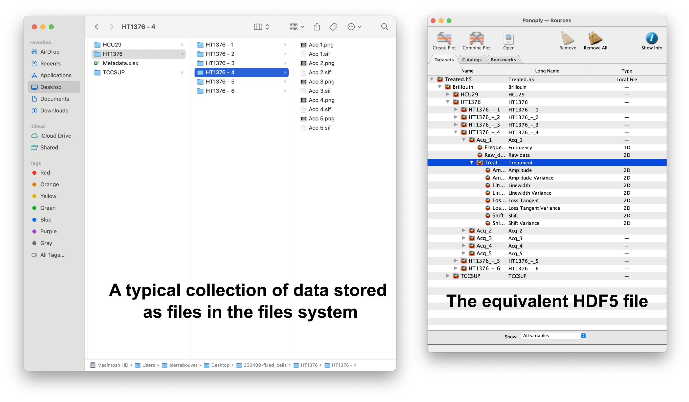
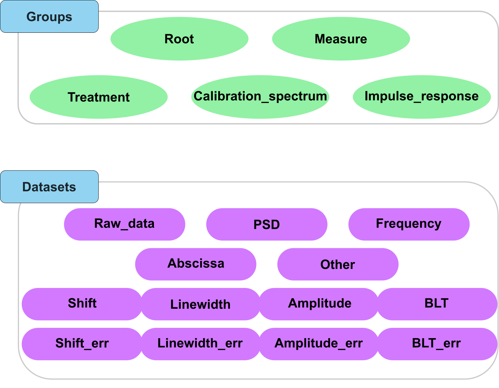

The project in a nutshell
=========================

The strategy for unifying the field of Brillouin Light Scattering (BLS) data
----------------------------------------------------------------------------

This project starts with the observation that different laboratories have different ways of storing their data, processing their data and sharing their data. These differences are not important until meta-studies are performed or studies where results need to be quantified. 

The underlying problem here is not clearly identified: differences between measures can come from the sample being used, the instrument or the processing steps after the measurement. To try to solve this problem, we here propose to unify the field of Brillouin Light Scattering (BLS) data by building a new file format that can be used to store and share BLS data, and a set of tools to process this data.

The main challenge of this project is the amount of different datasets that are used in BLS experiments, the diversity of treatments, and the very finite time individual researchers have to spend on moving towards unified solutions. To solve this problem, this project is meant to allow users to transition progressively towards a unified way of storing and processing their data. The goal here is not to set a fixed standard everyone has to use from day one, but rather an ideal solution for storing BLS data, then a set of pre-made choices for tagging these data, then a set of pre-made choices for processing these data, etc. while also allowing users to not use these choices whenever they want. The goal here is to bring users to the unified solution step by step, while answering along the way the usual challenges we meet when wanting to store our data (how to organize my data, how to link my results to it, how to keep track of all my processing steps, how to make sure the data I produce will be usable by others in the future, etc.)

To give a clear vision of the idea, here is a step by step description of what we propose :

- We encourage the use of the HDF5 file format
- We propose to use a basic structure to differentiate our HDF5 files from other HDF5 files
- We propose to organize our data in a hierarchical way, based on the idea of isolating measures from each other by assigning them a hierarchical level (a group)
- We propose to give each element of a measure (the measure itself, the derived datasets), a unique identifier to allow users to easily identify their nature (ie: a collection of raw spectra, Power Spectra, results of fits, etc.)
- We propose to assign metadata hierachically in the file (attributes of parent group apply by default to children groups and datasets)
- We propose a set of fixed nomenclature for attributes
- We propose a built-in solution to store any code used to process the data
- We finally propose a set of normalized processing libraries we provide to extract a power spectrum from the data and fit it to a model

.. note::
   A new user can therefore just start by storing their data in a HDF5 file, and then evolve to store their data in the more normalized fashion proposed here. As we generally re-use past codes, this means that the efforts made to use this project and normalize the storage and processing of data in the community can be spread while enjoying the benefits each steps of the process brings (e.g. having stored all the attributes of an experiment with your measure will save you a lot of time if you need to go back to it later and try to remember what you did).

Generally speaking, this project is aimed at helping users to solve challenges we all face when dealing with BLS data with custom solutions meant to be as universal as possible while still being normalized and easy to use, so that in the future, using this project will allow us all to share our BLS data and to perform meta-studies on them.

A quick overview
----------------

The file format is built to reproduce the file structure of a classical directory, with added benefits: 

- storage of datasets in a universally readable format
- storage of all data related to a given experiment in a single file that can be shared and that cannot be used to store executable code
- storage of metadata associated to the data together with the data
- storage of any BLS-related measures together with the BLS data (e.g. fluorescence, absorbance, grayscale images, etc.)
- storage of results of data processing
- storage of custom codes to process the data
- storage of algorithms steps when using the developped data processing tools

As an example, :numref:`file_system_HDF5_file` shows a concrete example of file structure corresponding to an experiment (left) and the corresponding HDF5 file (right, displayed using `Panoply <https://www.giss.nasa.gov/tools/panoply/>`__), used to store Brillouin Light Scattering data.

.. _file_system_HDF5_file:

   A concrete example of measures stored in a file system (left) and the corresponding HDF5 file structure (right, using `Panoply <https://www.giss.nasa.gov/tools/panoply/>`__).

Norm limitations
----------------

The HDF5_BLS norm is thought to be non-constraining. It's goal is to allow the storage of any kind of data, while still offering a way to organize it that can be shared. 

One particularity of this project is the "build to normalize" concept. This means that the project is built in a way that encourages users to first adopt the format and then the conventions suggested here in a progressive manner. The idea is to allow you to adjust your pipelines progressively to follow the norms we propose, allowing you to spread the amount of work to adjust to the new norm over time, and eventually build the tools to convert your old data to the new norm.

We provide a series of normalization points, from structuring the file to shaping the dataset to naming attributes. Note that all of these normalization steps are not constrained by default, and you will be able to use the project without following them. The goal is however to unify the organization in the long run.

One important aspect here is that metadata attributes are not constrained by default. Here again, you are not forced to abide by any norms. We however strongly encourage users to use the proposed nomenclature and units for the attributes as we have developed tools to minimize the amount of work to re-use metadata from previous experiments, and are also developping tools to estimate results at eg different wavelengths, different NA, etc based on the metadata. 

**To know more about the norms, please refer to the :ref:`normalization` section.**

One strong point of this project is the ability to store codes in the HDF5 file. Codes can be stored as simple text files in the attributes of the file. This allows you to store virtually everything you might ever use or have used to treat or visualize your data. This approach is complementary with the use of the provided modules, meant to unify data processing in the BLS community in the long run. 

To normalize data processing steps, we have developed two libraries:
- The *HDF5_BLS_analyse* module allows to define new algorithms to analyse the data (to extract a Power Spectral Density and a frequency axis from the data)
- The *HDF5_BLS_treat* module allows to define new algorithms to treat the data (to fit the data to a model, extract the results of the fit, etc.)

These libraries are built with an object oriented approach, meaning that they both define an object to do the treatment. These objects can easily be stored in the HDF5 file using custom methods of the *HDF5_BLS.Wrapper* class. This option is more interesting than the storage of scripts as it not only allows the user to use normalized data processes, but it also minimizes memory complexity and uses treatments that are optimized, editable and shareable with standalone JSON files (more on this on the :ref:`data_processing` section).

Storing different datasets in the file format
---------------------------------------------

In a general BLS experiment, the user will retrieve a series of values that have been collected. These values are not necessarily of the same physical nature (it can be the number of photons collected, an intensity profile varying with position or time, etc.). These measures are stored in the file format as "Raw Data" by default. This means that no specific physical meaning is given to them by default.

"Raw Data" are reserved to datasets carrying enough information to "see" the Spectral Density of Brillouin light scattering (BLS) signal on a spectrum. This dataset is usually obtained after a first processing step and is stored as a "PSD" dataset. A "frequency" dataset is associated to it. The collection of these two datasets constitutes a basis for any measure, and is stored in a dedicated group for the measure.

When these measures correspond to different parameters (a position in a sample, a time point, a given concentration, etc.), we need to store together with these measures, the values of these parameters. This is done with an "Abscissa" dataset that is stored together with the raw data or PSD, under the same "measure" group.

From there, we usually retrieve the shift and the linewidth of the peaks. These are stored as "Shift" and "Linewidth" datasets. Other results can also be stored such as the amplitude of the peaks, the Brillouin loss tangent (BLT), the standard deviation of the shift, the standard deviation of the linewidth, etc. To allow for multiple treatments of the same "PSD" datasets to be stored together with it, we create for each collection of results, a dedicated "treatment" group, where these results are stored.

Additionally, we can store impulse responses to characterize the instrument in a dedicated "Impulse response" group to differentiate it from the normal measures. We can also store the calibration spectrum in a dedicated "Calibration spectrum" group with the same idea. This distinction is aimed at allowing noramlization algorithms to be applied to the data automatically in future meta-studies involving all the community.

To organize this file hierarchically, we also need groups dedicated to storing groups. As they form the basis of a branch of the file tree, we call them "Root" groups. 

One last point to underline, is the existence of "Other" datasets. This type is reserved to any data that you might want to add with your measures, but that does not fit under the other categories (e.g. a Raman spectrum, a brightfield image, ...).

Overall, the diffrent types of groups and datasets that can be stored in the file format are shown in :numref:`Groups_and_datasets_type`.

.. _Groups_and_datasets_type:

   A visual representation of the Brillouin\_type attribute for groups and datasets in the HDF5 file.

To make the file human readable, we do not store the types of this groups and datasets in their name, but we create instead a dedicated attribute called "Brillouin\_type" that allows to know the type of the element. Note that if this string is not given or recognized, it is set to "Other" by default. This attribute is therefore the first step in normalizing the file format.

.. important::
   This very logical vision of the file format is not restrictive, and if you prefer to not store the raw data because you think it's not useful anymore, you don't have to. Same goes for the results: if you only need the shift array, you can just store this array. Same goes for the hierarchy: if you want to store the abscissa array in a parent group so that it applies to all the children measure groups, you can do so. To however allow sharing of these data with the community, we have defined a series of norms we rpesent in the :ref:`normalization` section.

