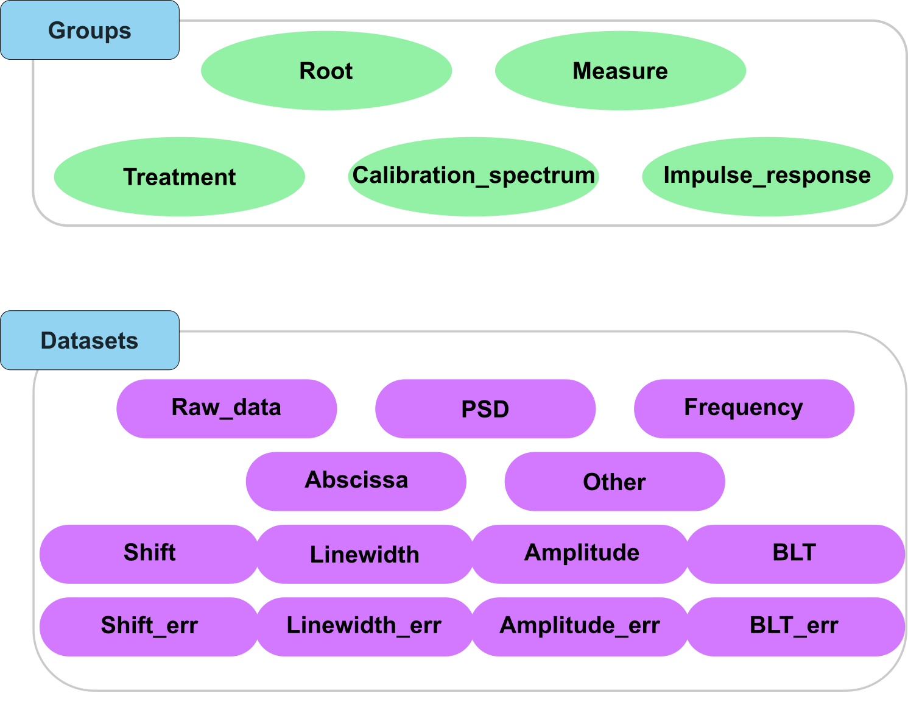

Quickstart
==========

Spirit of the project
---------------------

The idea of the package is to provide a simple way to store and retrieve data relevant to Brillouin Light Scattering experiments together with the metadata associated to the data. The file we propose to use is the HDF5 file format (standing for "Hierarchical Data Format version 5"). The idea of this project is to use this file format to reproduce the structure of a filesystem within a single file, storing all files corresponding to a given expoeriment in a single "group". For example, a typical structure of the HDF5 file could be:

.. code-block:: bash
   
   file.h5
   └── Brillouin
       ├── Measure of water
       │   ├── Image of the power spectral density
       │   ├── Channels associated to the power spectral density
       │   ├── Results after data processing
       │   │   ├── Shift
       │   │   ├── Shift variance
       │   │   ├── Linewidth
       │   │   ├── Linewidth variance
       │   │   ├── Amplitude
       │   │   ├── Amplitude variance
       │   │   ├── ... 
       ├── Measure of methanol
       │   ├── ...
   
To allow this file format to be used with other modalities (e.g. electrophoresis assays to complement a Brillouin experiment), we propose to use a top-level group corresponding a minima to the modality (e.g. "Brillouin"). We also propose to add to each element of the HDF5 file, a "Brillouin_type" attribute that will allow to know the type of the element. For datasets, these types are:

- Raw_data: the raw data
- PSD: a power spectral density array
- Frequency: a frequency array associated to the power spectral density
- Abscissa_x: an abscissa array for the measures where the name is written after the underscore.
- Shift: the shift array obtained after the treatment
- Shift_err: the array of errors on the shift array obtained after the treatment
- Linewidth: the linewidth array obtained after the treatment
- Linewidth_err: the array of errors on the linewidth array obtained after the treatment
- Amplitude: the amplitude array obtained after the treatment
- Amplitude_err: the array of errors on the amplitude array obtained after the treatment
- BLT: the Loss Tangent array obtained after the treatment
- BLT_err: the array of errors on the Loss Tangent array obtained after the treatment

For groups, these types are:

- Calibration_spectrum: the calibration spectrum
- Impulse_response: the impulse response
- Measure: the measure
- Root: the root group
- Treatment: the treatment

   A visual representation of the Brillouin\_type attribute for groups and datasets in the HDF5 file.

Installation
------------

To install the package, you can use pip:

.. code-block:: bash
   
   pip install HDF5_BLS

Usage
-----

Integration to workflow
^^^^^^^^^^^^^^^^^^^^^^^

Once the package is installed, you can use it in your Python scripts as follows:

.. code-block:: python
   
   import HDF5_BLS as bls
   
   # Create a HDF5 file
   wrp = bls.Wrapper(filepath = "path/to/file.h5")
   
   ###############################################################################
   # Existing code to extract data from a file
   ###############################################################################
   # Storing the data in the HDF5 file (for this example we use a random array)
   data = np.random.random((50, 50, 512))
   wrp.add_raw_data(data = data, parent_group = "Brillouin/Measure", name = "Raw data")
   
   ###############################################################################
   # Existing code to convert the data to a PSD
   ###############################################################################
   # Storing the Power Spectral Density in the HDF5 file together with the associated frequency array (for this example we use random arrays)
   PSD = np.random.random((50, 50, 512))
   frequency = np.arange(512)
   wrp.add_PSD(data = PSD, parent_group = "Brillouin/Measure", name = "Power Spectral Density")
   wrp.add_frequency(data = frequency, parent_group = "Brillouin/Measure", name = "Frequency")

   ###############################################################################
   # Existing code to fit the PSD to extract shift and linewidth arrays
   ###############################################################################
   # Storing the Power Spectral Density in the HDF5 file together with the associated frequency array (for this example we use random arrays)
   shift = np.random.random((50, 50))
   linewidth = np.random.random((50, 50))
   wrp.add_treated_data(parent_group = "Brillouin/Measure", name_group = "Treat_0", shift = shift, linewidth = linewidth)

   ###############################################################################
   # Other methods to add data to the HDF5 file
   ###############################################################################
   # If you want to add an abscissa array, you can use the following command where you specify which dimensions the abscissa array applies to
   wrp.add_abscissa(data, "Brillouin/Measure", name="Time", unit = "min", dim_start = 0, dim_end = 1, overwrite = False)
   # If you want to add a particular attribute, you can use the following command
   wrp.add_attributes({"an attribute": "its value"}, parent_group="Brillouin/Measure", overwrite=True)
   # If you want to add any other dataset, you can use the following command
   wrp.add_other(data, "Brillouin/Measure", name="Other", overwrite=True)

To summarize this example, we first create a HDF5 file. Then we add our data to it, placing it under a group named "Measure". Datasets are added based on their nature, with an associated function. Here we add a PSD, a frequency array, a shift and linewidth array and then an abscissa and another dataset. Here are the liste of functions to use depending on the type of data:

* Raw data (data straight from the spectrometer): add_raw_data
* PSD (a Power Spectral Density array): add_PSD
* Frequency (a frequency array associated to the power spectral density): add_frequency
* Abscissa (an abscissa array for the measures where the name is written after the underscore): add_abscissa
* Shift, Linewidth, or any other type of results: add_treated_data
* Other (the other data): add_other

We can then extract the data from the HDF5 file using the wrapper object. The wrapper object is initialized by running the following command:

.. code-block:: python

    wrp = Wrapper()

Extracting the data from the HDF5 file
^^^^^^^^^^^^^^^^^^^^^^^^^^^^^^^^^^^^^^

Once the data is stored in the HDF5 file, you can extract it as follows:

.. code-block:: python
   
   import HDF5_BLS as bls
   
   # Open the file
   wrp = bls.Wrapper(filepath = "path/to/file.h5")

   # Extract the data
   data = wrp["Brillouin/path/in/file/Raw data"]

To get the path leading to a dataset, you can either use existing software to browse the file (we recommend `Panoply <https://www.giss.nasa.gov/tools/panoply/>`__ and `myHDF5 <https://myhdf5.hdfgroup.org>`__), or you can use the HDF5\_BLS package to display the structure of the file:

.. code-block:: python

    print(wrp)